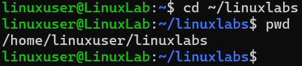

# Change Directory Lab

**Goal:** Learn how to move between directories in Linux.

**Tool Used:** Linux Terminal

**Steps I Took:**  
1. Ran `cd /` to go to the root directory  
2. Ran `cd /home` to move to the home folder  
3. Ran `cd ~` to return to my user folder  
4. Used `pwd` to confirm my location

**What I Learned:**  
`cd` is used to navigate the file system. Knowing how to move around is essential for Linux administration and cybersecurity tasks.

**Screenshot:**  

