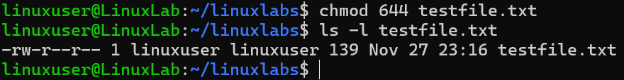

# Change File Permissions

## Overview
Practice modifying file permissions.

## Command
```bash
chmod 644 testfile.txt
ls -l testfile.txt
```

## Screenshot


## Observation
- Permissions updated successfully.

## Key Learning
- `chmod` sets read/write/execute permissions.
