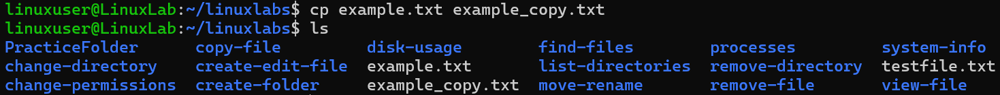

# Copy File

## Overview
Practice copying files.

## Command
```bash
cp example.txt example_copy.txt
ls
```

## Screenshot


## Observation
- `example_copy.txt` created as a duplicate.

## Key Learning
- `cp` duplicates files safely.
