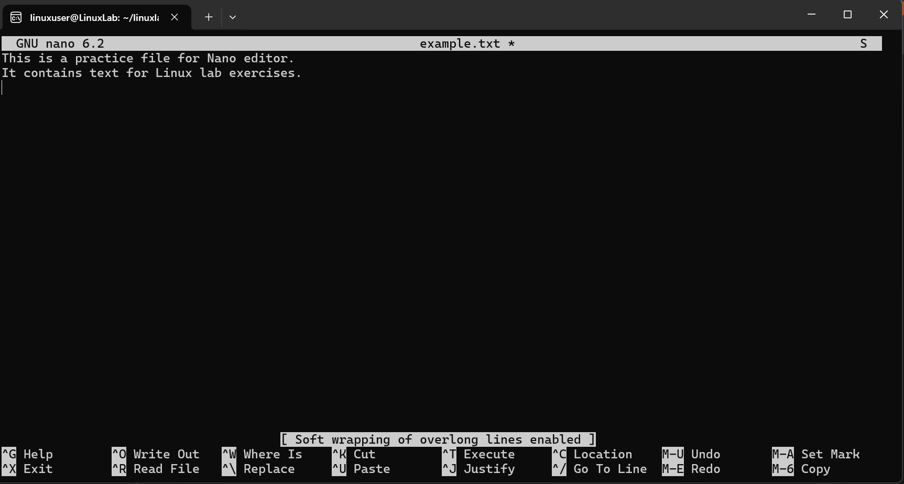

# Create and Edit File

## Overview
Practice creating and editing files using `nano`.

## Command
```bash
nano example.txt
```

## Screenshot


## Observation
- File created and edited successfully.

## Key Learning
- `nano` is beginner-friendly for editing files.
