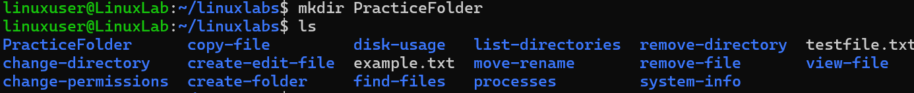

# Create Directory

## Overview
Practice creating directories.

## Command
```bash
mkdir PracticeFolder
ls
```

## Screenshot


## Observation
- `PracticeFolder` created successfully.

## Key Learning
- `mkdir` makes directories.
- Use `mkdir -p` for nested folders.
