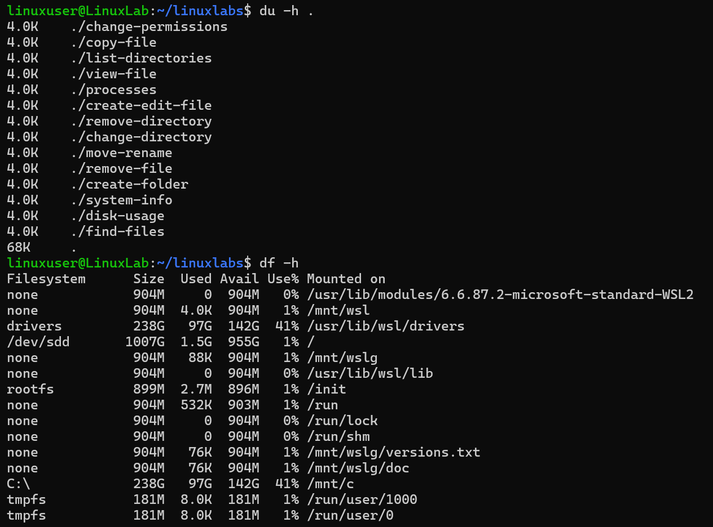

# Disk Usage

## Overview
Practice checking disk usage.

## Command
```bash
du -h .
df -h
```

## Screenshot


## Observation
- Shows folder sizes and disk usage.

## Key Learning
- `du` for directories/files.
- `df` for filesystem usage.
