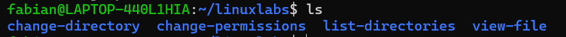

# List Directories Lab

**Goal:** Learn how to view directory contents in Linux.

**Tool Used:** WSL (Windows Subsystem for Linux)

**Steps I Took:**  
1. Opened the WSL terminal  
2. Created a main lab folder called `linuxlabs`  
3. Created subfolders: `list-directories`, `change-directory`, `view-file`, `change-permissions`  
4. Ran `ls` inside `linuxlabs` to confirm the directories were created

**What I Learned:**  
`ls` is the basic command for viewing the contents of a folder in Linux. Using WSL, I can run Linux commands directly in Windows, making it easy to practice Linux labs without a full VM.

**Screenshot:**  

