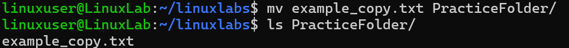

# Move/Rename File

## Overview
Practice moving or renaming files.

## Command
```bash
mv example_copy.txt PracticeFolder/
ls PracticeFolder/
```

## Screenshot


## Observation
- File moved successfully.

## Key Learning
- `mv` moves or renames files.
