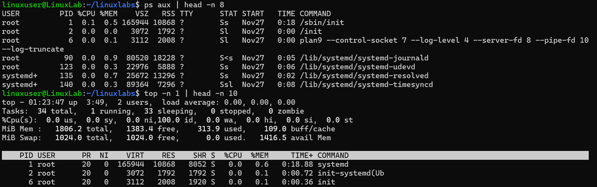

# Monitor Processes

## Overview
Practice monitoring processes in Linux using `ps` and `top`.

## Command
```bash
ps aux | head -n 8
top -n 1 | head -n 10
```

## Screenshot


## Observation
- Output truncated to show only the first 8 (`ps aux`) and first 10 (`top`) lines.  
- Displays active processes, their PID, CPU/memory usage, and user.  

## Key Learning
- `ps aux` shows all processes in a snapshot.  
- `top -n 1` shows real-time process info, truncated for clarity.  
- Truncating makes the screenshot readable without losing key information.
