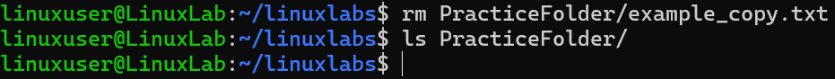

# Remove File

## Overview
Practice deleting files.

## Command
```bash
rm PracticeFolder/example_copy.txt
ls PracticeFolder/
```

## Screenshot


## Observation
- File deleted successfully.

## Key Learning
- `rm` permanently deletes files; use carefully.
