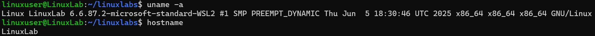

# View System Information

## Overview
Practice viewing system information.

## Command
```bash
uname -a
hostname
```

## Screenshot


## Observation
- Kernel, architecture, and hostname displayed.

## Key Learning
- `uname -a` provides OS info.
- `hostname` shows system name (safe now).
