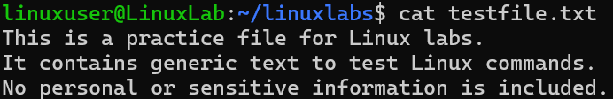

# View File Contents

## Overview
Practice reading a file using `cat` in Linux.

## Command
```bash
# View the contents of the file
cat testfile.txt
```

## Screenshot


## Observation
- File `testfile.txt` contains the following lines:
```
This is a practice file for Linux labs.
It contains generic text to test Linux commands.
No personal or sensitive information is included.
```
- `cat` displays all contents of the file in the terminal.

## Key Learning
- `cat` outputs file contents quickly.
- Useful for checking files before editing or processing.
