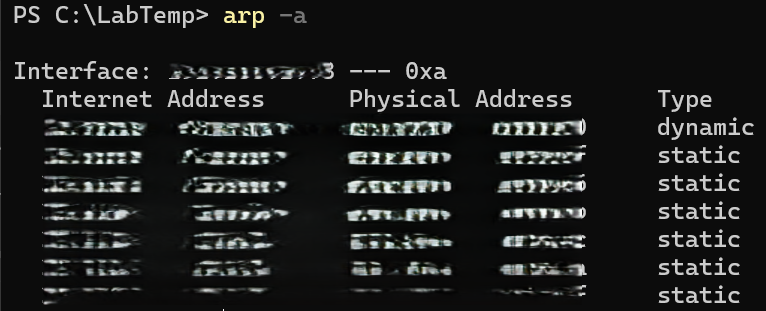

# ARP Table

**Objective:** Inspect MAC-to-IP mappings on the local network.

**Steps:**
1. Open PowerShell.
2. Run:
   arp -a
3. Review the list of IP addresses and MAC addresses.

**Results:**  
Shows ARP cache entries for devices on the local network.

**Key Learning:**  
ARP tables are useful for identifying local network devices and troubleshooting connectivity.
