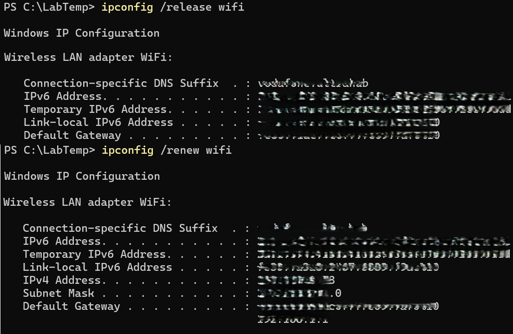

# DHCP Lease Release/Renew

## Screenshot

## Objective
Practice releasing and renewing DHCP leases to refresh IP addresses.

## Steps
1. Open PowerShell as Administrator.
2. Release current IP lease:

       ipconfig /release wifi

3. Renew the IP lease:

       ipconfig /renew wifi

## Observe
- New IPv4 address assigned by DHCP server.
- Subnet mask and default gateway may remain the same.
- Connection stays active after renew.

## Key Learning
- Useful for troubleshooting connectivity issues.
- Helps reset IP assignment conflicts on a network.
