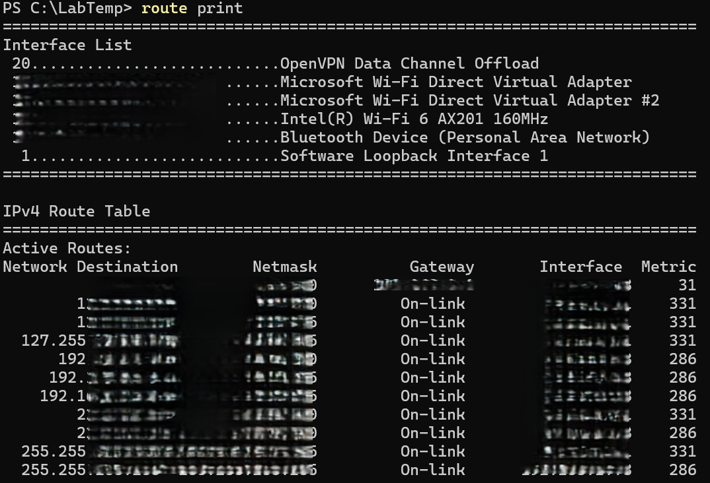

# IP Route

**Objective:** View the routing table of the system.

**Steps:**
1. Open PowerShell.
2. Run:
   route print
3. Review network routes and gateways.

**Results:**  
Displays all routes, including default gateway and network interfaces.

**Key Learning:**  
Understanding routes is essential for diagnosing network path issues.
