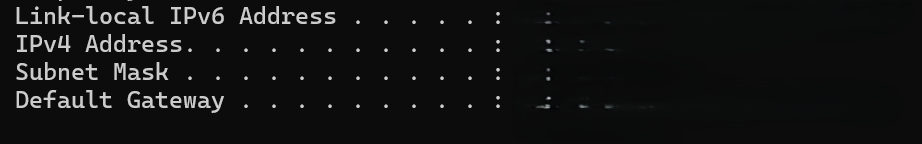

# IP Configuration

**Objective:** View IP address, subnet mask, and default gateway.

**Steps:**
1. Open PowerShell.
2. Run:
   ipconfig
3. Review your IPv4 Address, Subnet Mask, and Default Gateway.

**Results:**  
Displays local network configuration for all adapters.

**Key Learning:**  
`ipconfig` helps troubleshoot network connectivity and verify adapter settings.
