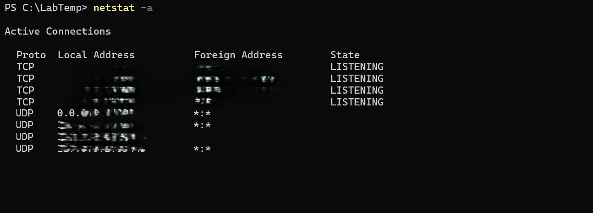

# Netstat

**Objective:** Display active network connections and listening ports.

**Steps:**
1. Open PowerShell.
2. Run:
   netstat -a
3. Review all active TCP/UDP connections and listening ports.

**Results:**  
Displays all current connections and services on the system.

**Key Learning:**  
`netstat` helps monitor network activity and detect unexpected connections.
