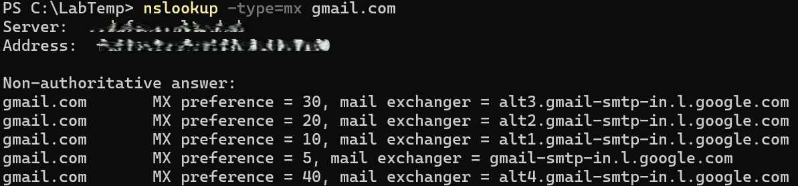

# MX Record Lookup

## Screenshot

## Objective
Retrieve the mail server (MX) records for a domain.

## Steps
1. Open PowerShell.
2. Run the command:

       nslookup -type=mx gmail.com

## Observe
- MX records for gmail.com showing which servers handle email.
- Preference values for each mail server.

## Key Learning
- MX records indicate email routing for a domain.
- Useful for troubleshooting email delivery issues.
