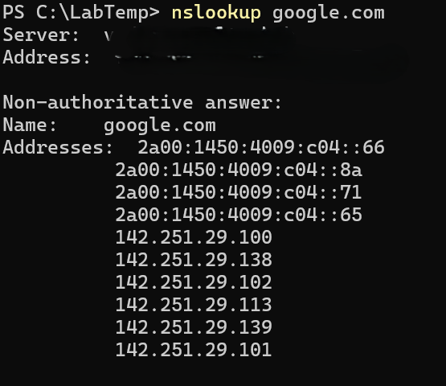

# Nslookup

**Objective:** Perform DNS queries to resolve domain names.

**Steps:**
1. Open PowerShell.
2. Run:
   nslookup google.com
3. Observe the returned IP addresses.

**Results:**  
The DNS server returns the IP address for the domain.

**Key Learning:**  
`nslookup` is useful to verify DNS resolution and troubleshoot domain issues.
