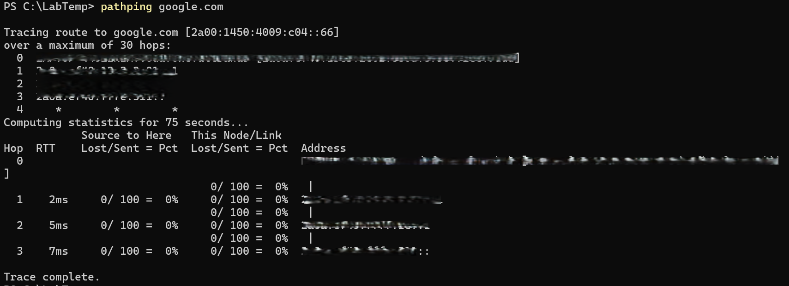

# Trace Network Path – pathping google.com

## Screenshot

## Objective
Use pathping to analyze the route packets take and measure packet loss at each hop.

## Steps
1. Open PowerShell.
2. Run the following command:

       pathping google.com

## Observe
- The list of hops between your device and Google.
- Any packet loss at specific routers.
- Latency measurements per hop.

## Key Learning
- pathping combines traceroute + ping into one tool.
- Helps identify where packet loss occurs on a network path.
- Useful for diagnosing routing issues or ISP problems.
