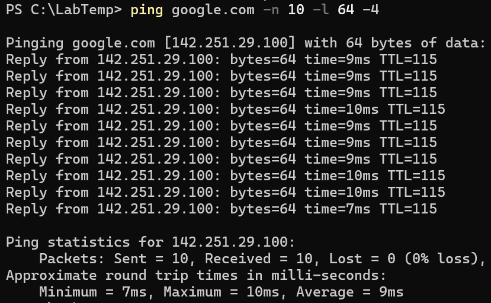

# Advanced Ping Test – ping google.com -n 10 -l 64 -4

## Screenshot

## Objective
Run an advanced ping test using specific packet count, packet size, and IPv4 enforcement.

## Steps
1. Open PowerShell.
2. Run the following command:

       ping google.com -n 10 -l 64 -4

   Where:
   - -n 10 → send 10 echo requests
   - -l 64 → packet size of 64 bytes
   - -4 → force IPv4

## Observe
- The IPv4 address Google resolves to.
- Latency for each of the 10 packets.
- Whether any packets fail or time out.

## Key Learning
- `-n` controls how many packets are sent.  
- `-l` controls the packet size.  
- `-4` forces IPv4 instead of IPv6.  
- This test helps check stability and consistency of a network connection.
