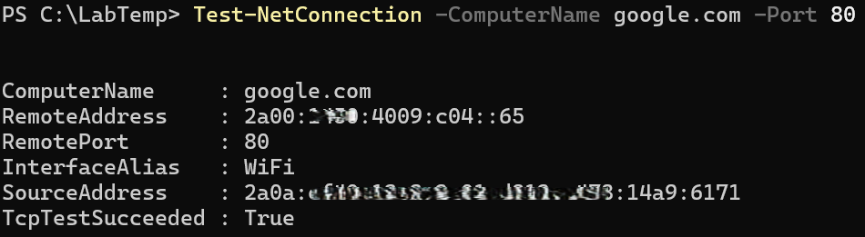

# Port Scan (Basic)

**Objective:** Check if specific ports are open on a host.

**Steps:**
1. Open PowerShell.
2. Run:
   Test-NetConnection -ComputerName google.com -Port 80
3. Observe if the port is reachable.

**Results:**  
Confirms connectivity to the specified service port.

**Key Learning:**  
Port scanning helps identify available services and troubleshoot network access.
