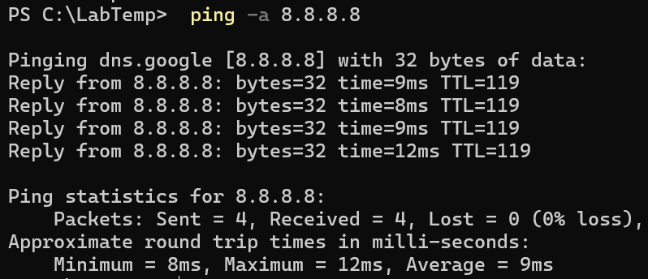

# Reverse DNS Lookup (ping -a)

## Screenshot

## Objective
Perform a reverse DNS lookup to resolve an IP address back into a hostname.

## Steps
1. Open PowerShell.
2. Run the command:

       ping -a 8.8.8.8

3. Observe whether a hostname appears before the ping reply lines.

## Observe
- The command attempts to resolve **8.8.8.8** to a hostname.
- If successful, the hostname appears at the top of the output.

## Key Learning
- `ping -a` performs reverse DNS lookup.
- Not all IP addresses resolve to hostnames.
- Useful for identifying unknown hosts on a network.
