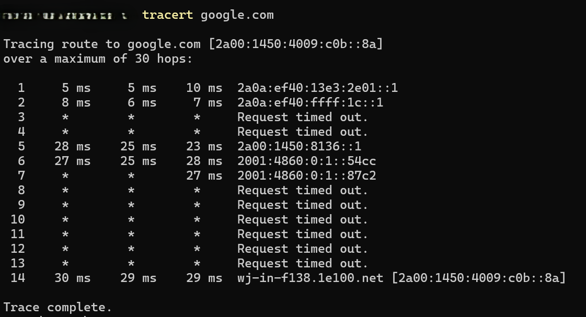

# Traceroute Basics

**Objective:** Trace the route packets take to a host.

**Steps:**
1. Open PowerShell.
2. Run:
   tracert google.com
3. Observe each hop along the path.

**Results:**  
Shows the path and time taken for packets to reach the host.

**Key Learning:**  
`tracert` identifies network hops and helps troubleshoot delays or connectivity issues.
