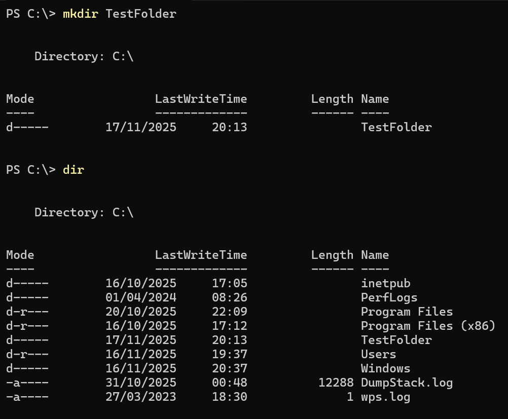

# Create Folder Lab

**Goal:** Learn how to create directories in PowerShell.

**Tool Used:** Windows PowerShell

**Steps I Took:**  
1. Opened PowerShell  
2. Ran `mkdir TestFolder`  
3. Used `dir` to confirm the folder was created

**What I Learned:**  
`mkdir` safely creates folders and is useful for organizing files or preparing directories for scripts and projects.

**Screenshot:**  

