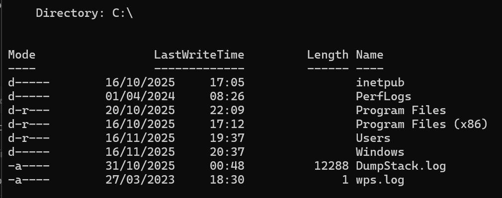

# List Files PowerShell Lab

**Goal:** Learn how to view files and folders in a directory.

**Tool Used:** Windows PowerShell

**Steps I Took:**  
1. Opened PowerShell  
2. Ran `dir`  
3. Viewed file names, sizes, and modification dates

**What I Learned:**  
`dir` lets me quickly see everything inside the current directory and is useful for navigating and inspecting the file system.

**Screenshot:**  

